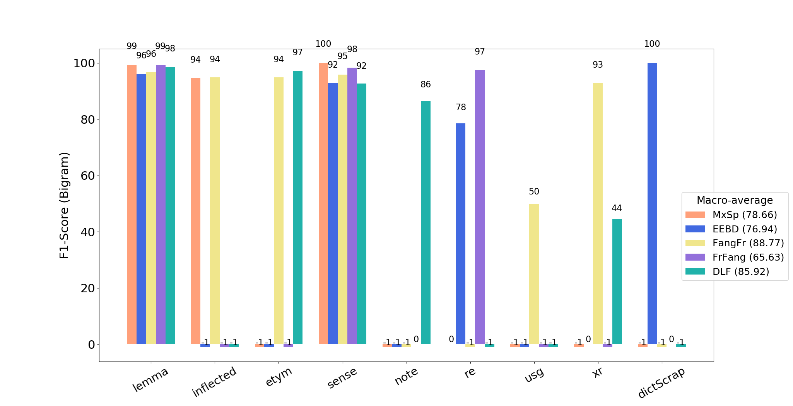

## Purpose

**GROBID-Benchmark** is a library for automating experiments with models of GROBID tools and visualising their evaluation reports. 

## Supported tools 

We started to support key models in [GROBID](https://github.com/kermitt2/grobid) and [GROBID-Dictionaries](https://github.com/MedKhem/grobid-dictionaries). We are working on supporting the models of other tools in the GROBID family such as [GROBID-Cat](https://github.com/MedKhem/grobid-cat) 

## Example of Benchmarking Scenarios

__Mono-Sample training__

__Multi-Sample training__

__Learning Curve__

