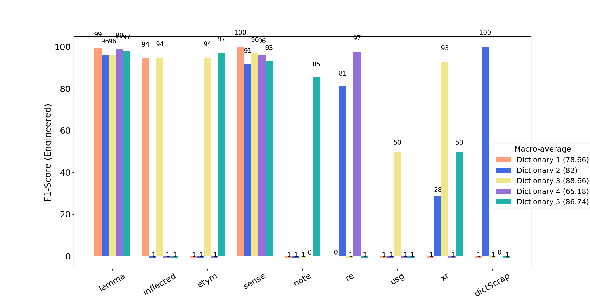
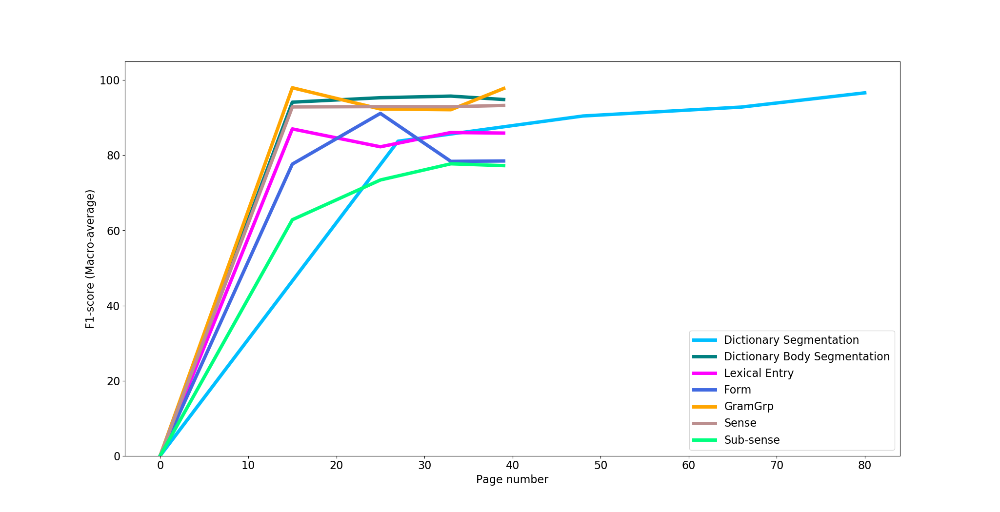

## Purpose

**GROBID-Benchmark** is a library for automating experiments with models of GROBID tools and visualising their evaluation reports. 

## Supported tools 

We started to support key models in [GROBID](https://github.com/kermitt2/grobid) and [GROBID-Dictionaries](https://github.com/MedKhem/grobid-dictionaries). We are working on supporting the models of other tools in the GROBID family such as [GROBID-Cat](https://github.com/MedKhem/grobid-cat) 

## Example of Benchmarking Scenarios

__Multi-Sample training__

To experiment the generation of such figures, you could follow instructions of _Scenario 1_  on the [Wiki page](https://github.com/MedKhem/grobid-benchmark/wiki/Example-of-Usage-Scenarios#scenario-1-visualising-the-evaluation-of-a-multi-sample-training)

__Learning Curve__
To experiment the generation of such figures, you could follow instructions of _Scenario 2_ on the [Wiki page](https://github.com/MedKhem/grobid-benchmark/wiki/Example-of-Usage-Scenarios#scenario-2-visualising-the-learning-curve-of-trained-models) 

## Requirements
* Python 3 or higher 

* Matplotlib 3.1.1 

## Contact

Mohamed Khemakhem (mohamed.khemakhem@inria.fr)
